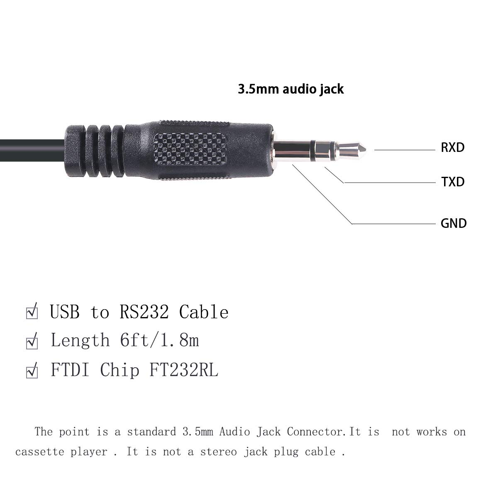
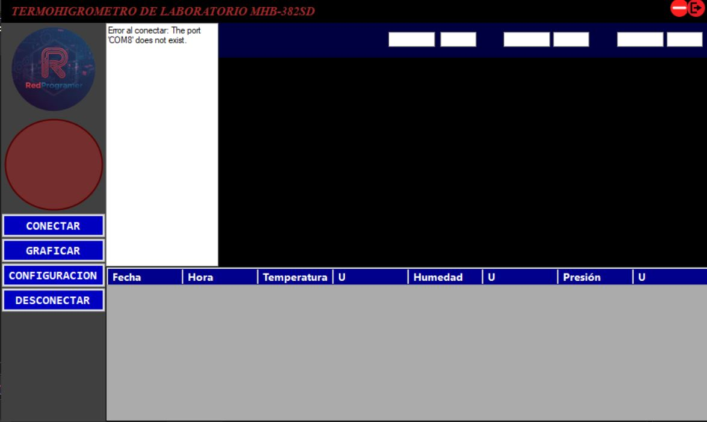
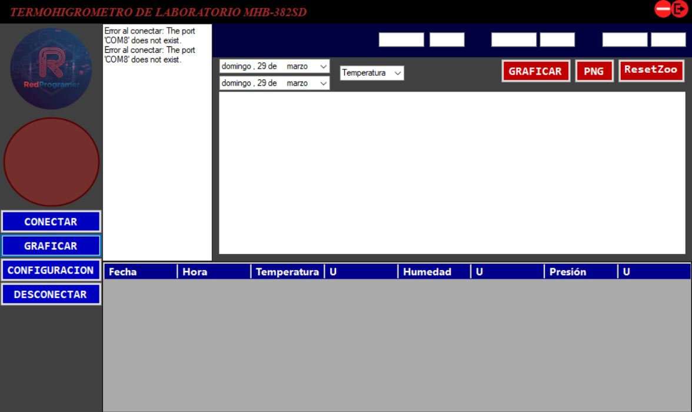
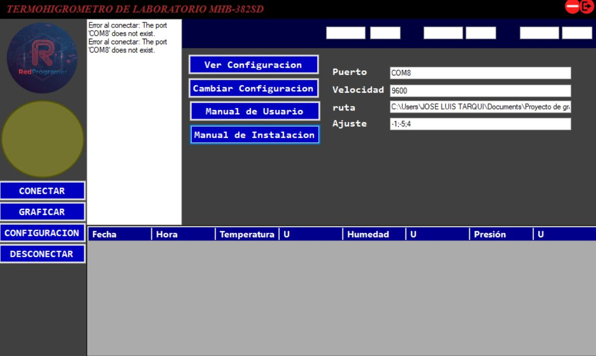

# 📊 Sistema de Adquisición de Datos para Termohigrómetro MHB-382SD

## 📌 Descripción

Este proyecto implementa un sistema de adquisición de datos que permite la lectura automática de un termohigrómetro **MHB-382SD** a través de su interfaz serial tipo **RS-232 (jack)**.

El sistema permite:

* Lectura continua de datos de temperatura y humedad.
* Visualización gráfica en tiempo real.
* Configuración del puerto de comunicación.
* Almacenamiento de datos adquiridos.
* Exportación de gráficas generadas.

---

## 🎯 Objetivo

Automatizar la adquisición, visualización y procesamiento de datos provenientes del termohigrómetro **MHB-382SD**, facilitando su uso en entornos de laboratorio y mejorando la eficiencia en la generación de reportes.

---

## ⚙️ Tecnologías utilizadas

* Dispositivo de medición: Termohigrómetro MHB-382SD
* Interfaz de comunicación: RS-232 (jack)
* Conversor USB a TTL: CP2102
* Lenguaje / plataforma: C# (.NET Framework)

Documentación de referencia:

* Manual del equipo: https://www.sunwe.com.tw/lutron/MHB-382SDeop.pdf
* Módulo CP2102: https://naylampmechatronics.com/conversores-ttl/79-modulo-cp2102-conversor-usb-a-serial-ttl.html

---

## 🚀 Instalación

1. Conectar el cable tipo jack del termohigrómetro al módulo conversor **CP2102**.
2. Conectar el módulo CP2102 al puerto USB del computador.
3. Ejecutar la aplicación.
4. Configurar:

   * Puerto COM correspondiente
   * Ruta de almacenamiento de datos
   * Parámetros de corrección (usar coma decimal si aplica)
5. Presionar el botón **Conectar**.

En caso de error:

* Se activará un indicador visual (LED).
* Se mostrará un mensaje en el cuadro de diálogo.

---

## 🧪 Uso

Este sistema puede utilizarse como:

* Herramienta de adquisición de datos en laboratorio.
* Plataforma base para procesos de calibración de instrumentos.
* Sistema de apoyo para generación de reportes experimentales.

Permite optimizar el proceso de captura de datos y mejorar la trazabilidad de las mediciones.

---

## 📷 Capturas

---

## 👨‍💻 Autor

**Richard Alfredo Tarqui Mamani**

